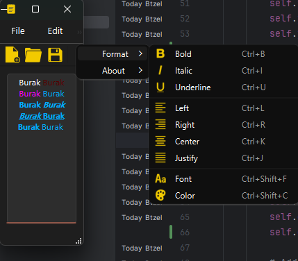
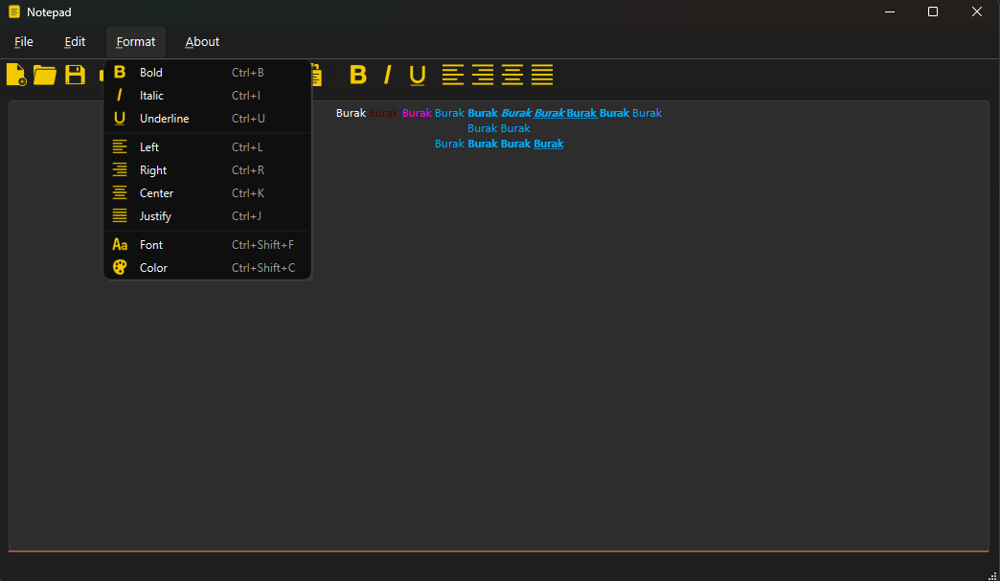

# PyQt6 Notepad
A modern text editor built with Python and PyQt6, featuring a rich set of text editing capabilities, file management, and formatting options.


## 🎯 Overview
A feature-rich text editor that provides:
1. Complete text editing capabilities
2. Multiple file format support
3. Rich text formatting
4. Print and PDF export
5. Modern user interface

## 📸 Application Preview







## 🚀 Features
### File Operations
- Create new files
- Open existing files
- Save files
- Print documents
- Export to PDF
- Print preview

### Text Editing
- Undo/Redo
- Cut/Copy/Paste
- Text formatting
- Font selection
- Color selection

### Formatting Options
- Bold, Italic, Underline
- Text alignment
- Font customization
- Color customization
- Justify text

## 📘 How to Use

### Shortcuts
1. **File Management**
   - New File: Ctrl+N
   - Open File: Ctrl+O
   - Save File: Ctrl+S
   - Print: Ctrl+P or

2. **Text Editing**
   - Cut: Ctrl+X
   - Copy: Ctrl+C
   - Paste: Ctrl+V
   - Undo: Ctrl+Z
   - Redo: Ctrl+Y

3. **Text Formatting**
   - Bold: Ctrl+B
   - Italic: Ctrl+I
   - Underline: Ctrl+U
   - Align Left: Ctrl+L
   - Align Right: Ctrl+R
   - Center: Ctrl+K
   - Justify: Ctrl+J

#### Advanced Features
1. **Document Export**
   - Export to PDF: Ctrl+E
   - Print Preview: Ctrl+Shift+P

2. **Text Customization**
   - Change Font: Ctrl+Shift+F
   - Change Color: Ctrl+Shift+C

## 🛠️ Installation
1. Install required packages:
```bash
pip install PyQt6
```

2. Clone the repository:
```bash
git clone https://github.com/Btzel/pyqt6-notepad-app.git
```

3. Run the application:
```bash
python main.py
```

## 📁 Project Structure
```
notepad/
├── src/
│   ├── main.py              # Application entry
│   ├── main_window.py       # Main window setup
│   ├── menubar/            # Menu implementations
│   │   ├── file_menu.py
│   │   ├── edit_menu.py
│   │   ├── format_menu.py
│   │   ├── about_menu.py
│   │   └── menu_bar.py
│   └── toolbar/           # Toolbar implementation
│       └── tool_bar.py
└── resources/
    └── icons/             # Application icons
```

## 💻 Supported File Formats
- Text Files (.txt)
- Python Files (.py)
- Markdown Files (.md)
- HTML Files (.html)
- Rich Text Files (.rtf)
- PDF Export (.pdf)

## 🔧 Technical Features
### UI Components
- Custom menu bar
- Configurable toolbar
- Status bar
- Text editing area
- File dialogs

### Text Processing
- Rich text support
- Multiple formats
- Font management
- Color handling
- Text alignment

## 📝 License
This project is licensed under the MIT License - see the [LICENSE](LICENSE) file for details.

## 👥 Author
Burak TÜZEL